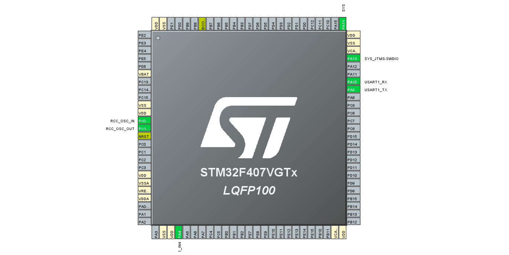
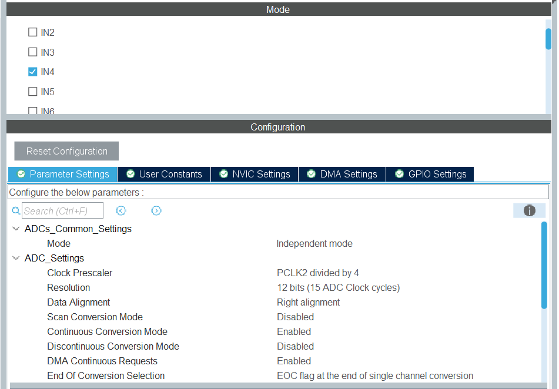
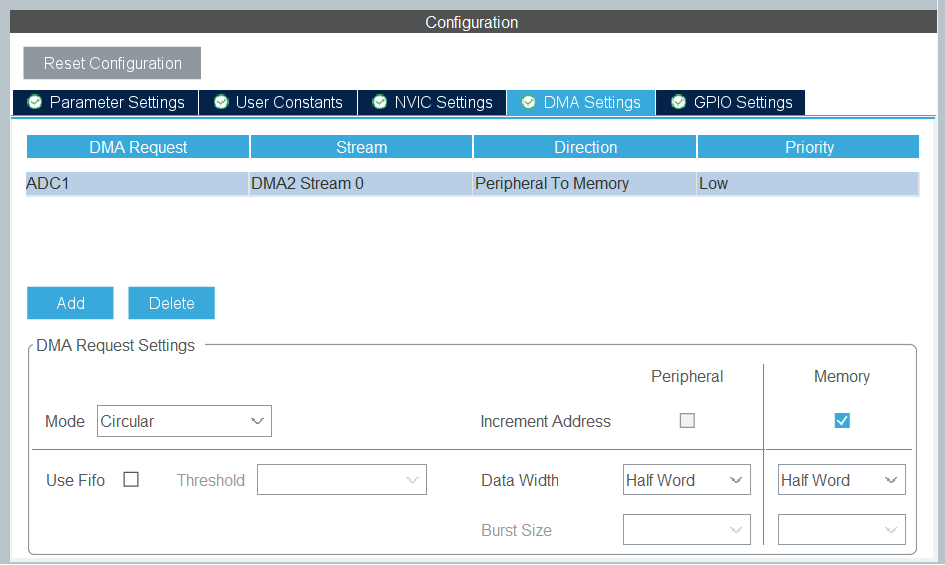
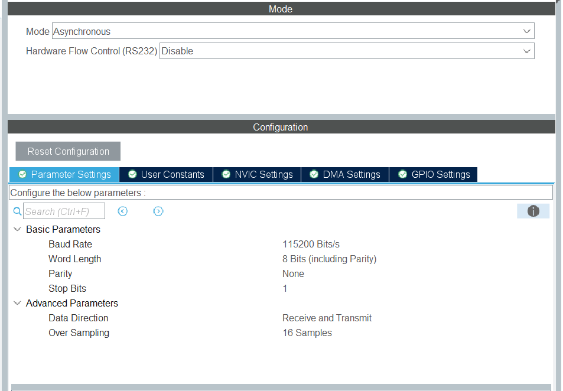
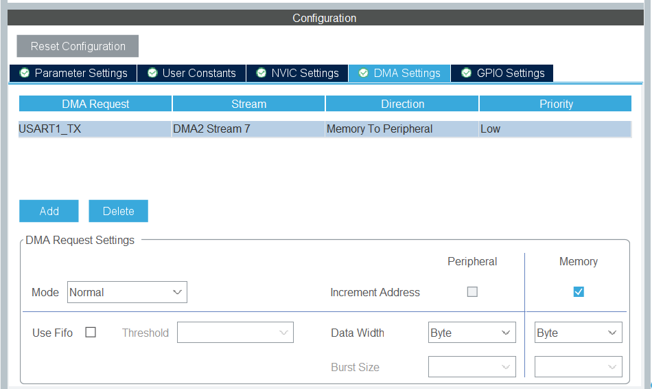

# STM32F407 FreeRTOS ADC & UART DMA Example

This project demonstrates how to use **FreeRTOS** on an **STM32F407VGT6** microcontroller to perform **ADC sampling using DMA (circular mode)** and transmit processed data over **UART using DMA (normal mode)**.

---

## 🧠 Project Overview

The firmware implements a real-time data acquisition and communication system using two FreeRTOS tasks and one message queue:

- **Task 1 – ADC Sampling Task:** Continuously samples the ADC using DMA in circular mode, computes the average, and sends it to a queue.
- **Task 2 – UART Transmission Task:** Waits for messages from the queue and sends them through UART using DMA in normal mode.

---

## ⚙️ System Architecture

| Component | Configuration / Purpose |
|------------|-------------------------|
| **MCU** | STM32F407VGT6 |
| **RTOS** | FreeRTOS |
| **ADC** | DMA Circular Mode (continuous sampling) |
| **UART** | DMA Normal Mode (data transmission) |
| **Tasks** | 2 (ADC Sampling, UART Transmission) |
| **Queue** | 1 (for ADC averages) |
| **IDE** | Originally developed in Keil µVision (source is tool-agnostic) |

---

## 🔁 Workflow

1. ADC samples continuously via DMA (circular mode).  
2. The ADC task computes the average of samples and sends it to a queue.  
3. The UART task waits for new data in the queue.  
4. When data is available, it transmits via UART DMA (normal mode).  

---

## 🧩 FreeRTOS Objects Used

| Object Type | Role |
|--------------|------|
| **Task** | `ADC_Task` – performs ADC sampling & averaging |
| **Task** | `TX_UART_Task` – sends averaged data through UART DMA |
| **Queue** | `TX_Queue` – holds averaged ADC data between tasks |

---

## 🛠️ CubeMX / Firmware Configuration Summary

- **ADC1**: DMA circular mode, 12-bit, continuous conversion enabled  
- **UART1**: Baudrate 115200, DMA normal mode (TX)  
- **DMA**: Configured for ADC and UART in CubeMX  
- **FreeRTOS**: Two tasks + one queue  

---

## 🧭 STM32CubeMX Configuration Screenshots

**MCU Pinout:**  

  
  

**ADC Configuration:**  

  
  

**UART Configuration:**  

  
  

---

## 💡 Notes

- The source code can be built in **STM32CubeIDE** for a fully open-source workflow.  
- The project files do **not** include any proprietary or compiled Keil binaries.

---

## 📄 License

This project is released under the **MIT License**.  
You are free to use, modify, and share it for educational or professional purposes.

---

## 👨‍💻 Author

**Mohammad Nayeb**  
Embedded Software Developer  
[LinkedIn](https://linkedin.com/in/mohammad-nayeb) • [GitHub](https://github.com/mohammadna111)

---
